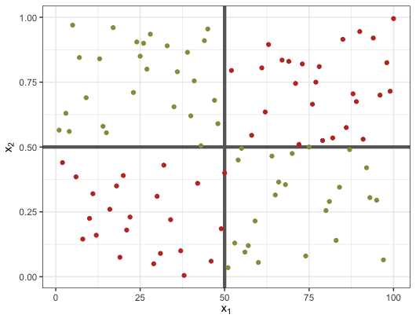
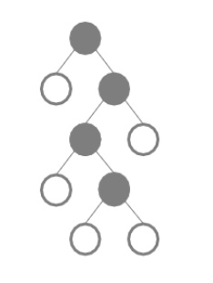
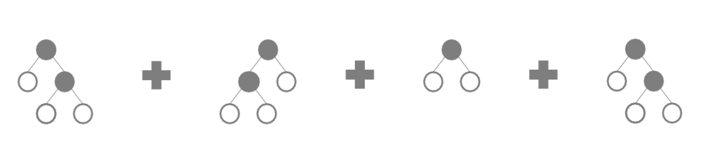
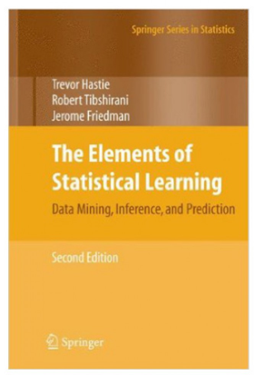

```{r setup, include=FALSE}
knitr::opts_chunk$set(echo = FALSE, 
                      warning = FALSE, message = FALSE, 
                      cache = FALSE, fig.align='center')
library(tidyverse)

library(RefManageR)
bibs <- ReadBib("refs.bib", check = FALSE)

```

class: middle

# Outline

- Introduction
- Trees
  - Model
  - Using in `R`
- Random Forests
  - Model 
  - Using in `R`
- Resources 

---

class: middle 

.pull-left[
```{r, echo = FALSE, out.width="70%", eval = TRUE}
knitr::include_graphics("img/bruna.jpg")
```
] .pull-right[
**Bruna Wundervald**
- Ph.D. Candidate in Statistics at Maynooth University.
- Twitter: @bwundervald
- GitHub: @brunaw
]


Link for this presentation:  http://brunaw.com/slides/rladies-dublin/RF/intro-to-rf.html

---

# Introduction

- Goal: predict continous or class variables 

- How?
  - Using data split into train and test set
  - Tree-based models to create predictions based on a set
  of explanatory/predictor variables


---

# Pre-requisites


.pull-left[
```{r, out.height="30%", out.width="50%", fig.height=5}
knitr::include_graphics("img/pipe.png")
```

```{r, out.height="30%", out.width="50%", fig.height=5}
knitr::include_graphics("img/dplyr.png")
```

]

.pull-right[

- `%>%`: applies to what is on the right the operations at the left
- `dplyr`: a set of (very) useful functions for data manipulation 
- `ggplot2`: graphic tools, following the [grammar of graphics](https://byrneslab.net/classes/biol607/readings/wickham_layered-grammar.pdf)

<br>


```{r, out.height="30%", out.width="50%", fig.height=5}
knitr::include_graphics("img/ggplot2.png")
```


]

---
class: inverse, middle, center 

## Trees 🌳 


---
class: middle

# Trees: the model 

```{r, out.height="30%", out.width="50%", fig.height=5}
knitr::include_graphics("img/trees.png")
```


---

# Trees: the model

Suppose we have a response variable $Y$ (continuous or class), and
a set of predictor variables $\mathbf{X}$. 

- Trees stratify the predictors'space into regions 
- Uses binary splitting rules to find the regions

.pull-left[
```{r, out.height="30%", out.width="80%", fig.height=5}
knitr::include_graphics("img/vars_space.png")
```
]
.pull-right[
```{r, out.height="30%", out.width="80%", fig.height=5}
knitr::include_graphics("img/vars_space2.png")
```
]

Breaks in the predictors'space `r Citep(bibs[key = "HastieTrevor"])`


---

# Trees: the algorithm

Recursive binary splitting: 


  - Select the predictor $X_j$ and the cutpoint $s$ such that 
the split $\{X | X_j <  s\}$ and $\{X | X_j \geq  s\}$ leads to
the greatest reduction in the variance of $Y$. 
    - All predictors and all available cutpoints are tested
  
  - For each region found, predict either the mean of $Y$ in the region
(continuous case) or the most common class (classification case). 

  - Continue until some criterion is reached
    - Example: continue until no region contains more than 5 observations

---

# Trees: the algorithm


- Continuous response: the goal is to find the tree that minimizes the
sum of squared errors, or

$$\sum_{j = 1}^{J} \sum_{i \in R_j} (y_i - \hat y_{R_j})^2,$$

where $R$ are the $J = 1,\dots, R$ regions found by the tree. 

- Class/factor response: the goal is to find the tree that best
separates the classes, minimizing the **Gini index**

$$G = \sum_{k = 1}^{K} \hat p_{jk} ( 1 - \hat p_{jk})$$
where $K$ is the total of classes  in the $j$-th region. 

---

# Trees: advantages

- Very interpretable: close to the human-decision process
- Can be displayed graphically 
- Handle well non-linearities **between** the predictors

```{r, echo = FALSE, out.width="60%", eval = TRUE}

```


---
# Trees: in `R` 

Using the `diamonds` data, from the `ggplot2` package, split in 
**train** and **test** sets:

```{r, echo = TRUE}
set.seed(2019)
data <- diamonds %>% 
  mutate(set = ifelse(runif(nrow(.)) > 0.75, "test", "train"))

train <- data %>% filter(set == "train") %>% select(-set)
test <- data %>% filter(set == "test") %>% select(-set)
glimpse(data)
```


---

**Goal**: predict the price of the diamonds, price in US dollars (\$326--\$18,823)

Variables:

 - `carat`: weight of the diamond (0.2--5.01)
 - `cut`: quality of the cut (Fair, Good, Very Good, Premium, Ideal)
 - `color`: diamond colour, from D (best) to J (worst)
 - `clarity`: a measurement of how clear the diamond is 
 (I1 (worst), SI2, SI1, VS2, VS1, VVS2, VVS1, IF (best))
 - `x`: length in mm (0--10.74)
 - `y`: width in mm (0--58.9)
 - `z`: depth in mm (0--31.8)
 - `depth`: total depth percentage = z / mean(x, y) = 2 * z / (x + y) (43--79)
 - `table`: width of top of diamond relative to widest point (43--95)


---

```{r, echo = TRUE}
train %>% 
  ggplot(aes(price)) +
  geom_density(fill = "#ff6767", alpha = 0.5) +
  theme_bw(22)
```


---
# Trees: in `R` 

`rpart` + `rpart.plot` packages!

```{r, echo = TRUE}
library(rpart)
library(rpart.plot)

first_model <- rpart(price ~ color, 
                     data = train)
first_model
```

---
class: middle

# Plotting the tree

```{r, echo = TRUE, fig.width=10, fig.height=10}
rpart.plot(first_model)
```

---


```{r, echo = TRUE, eval = TRUE}

# Adding now a few more predictors

second_model <- rpart(price ~ cut + color + depth + carat, 
                     data = train)
second_model

```


---

```{r, echo = TRUE, fig.width=10}
rpart.plot(second_model)
```


---

## Variable importance 

- A measure of "how important" each variable is for the final result
  - Represents the decrease in the variance/impurity caused by the 
  addition of a variable to the tree 

```{r, echo = TRUE}
first_model$variable.importance/max(first_model$variable.importance)
```


```{r, echo = TRUE}
second_model$variable.importance/max(second_model$variable.importance)
```

(Much better seen as a normalized measure!)

- Clearly, the `carat` dominates the tree

---

# Predictions

```{r, echo = TRUE}
pred_first <- predict(first_model, test)
pred_second <- predict(second_model, test)

rmse <- function(x) sqrt(sum((x - test$price)^2))

rmse(pred_first)
rmse(pred_second)
```


Should we disregard the bad tree? **No**!


---

class: center, middle, inverse

##  🌵🌳🌲🌿  Random Forests 🌴🌲🌵🌳  

---

#  Random Forests

- It's a sum of "tweaked" trees
  - We grow **B** trees in bootstrap samples of the original data, 
  and later average their predictions  

- The big difference: at each split, only $m \approx \sqrt(p)$
variables are tested

Why? It decorrelates the trees, avoiding that **strong** 
predictors always appear on top 
- It creates different trees at each time and all of them
contribute to the final prediction 

Algorithm: same as for the tree, but with bootstrapped data

<font color = "#ff6767"> The algorithm is very naive, but how naive? </font>  

---

#  Trees and Random Forests
Trees:
```{r, echo = FALSE, out.width="25%", eval = TRUE}

```

Random Forests:
```{r, echo = FALSE, out.width="90%", eval = TRUE, out.height="60%"}

```


---


<font size='45'> Imagine now that you have to buy the fruit trying to pick the one that tastes the better:  🍉 🍊  🍇    </font>

- A **Bayesian** person would: pick the fruit that he or she likes the most
(using previous information)

- A **frequentist** person would: ask the seller which one other people
bought the most 

What the **random forest** 'would do': try all the fruits and decide 
later. Naturally slower! 

---
# How to overcome slowness?

  - Use fast programming languages (e.g. `c++`)
  
Packages for random forests in `R`, that are actually written in
`c` and `c++`:

  - `randomForest`: written by the author, Leo Breiman
  - `ranger`: a faster version of the RF algorithm 
  

Common arguments in the `ranger()` function: 
  - `mtry`: number of variables to try at each split (default to m = sqrt(p))
  - `num.trees`: number of trees to build (default to 500)
  - `min.node.size`: minimum number of observations in each node (default to 5)

---

# Random forests: in `R`

```{r, echo = TRUE}
library(ranger)

# only a tree
first_rf <- ranger(price ~ cut + color + depth + carat, 
                   num.trees = 1, mtry = 4, data = train)

first_rf
```


The summary is actually very clear!

# 'out-of-bag' error

  - The bootstrapped samples used around $\approx 2/3$ of the original
  observations for each tree
  - The remaining 1/3 is used to create predictions
    - Those predictions are averaged for each $i$-th observation 
    (in the regression case)
    
  - The resulting OOB error is a valid estimate of the error of the model

---

# Random forests: in `R`


```{r, echo = TRUE}

# A forest, adding all the variables as predictors
second_rf <-  ranger(price ~ ., num.trees = 50, data = train,
                     importance = "impurity")

second_rf
```


---

# Predictions 

```{r, echo = TRUE}
pred_rf_first <- predict(first_rf, test)$predictions
pred_rf_second <- predict(second_rf, test)$predictions
rmse(pred_rf_first)
rmse(pred_rf_second)
```

Much better!

---

## How are the predictions compared to the observed data?

```{r, fig.width=4.5, fig.height=4.5, echo = TRUE}
test %>% 
  mutate(predicted = predict(second_rf, test)$predictions) %>% 
  ggplot(aes(predicted, price)) +
  geom_point(colour = "#ff6767", alpha = 0.3) +
  labs(title = "Predicted and observed") +  theme_bw(18)
```


---


## Evaluating importances

```{r, fig.width=4, fig.height=4, echo = TRUE}
imps <- data.frame(var = names(train)[-7],
                   imps = second_rf$variable.importance/max(second_rf$variable.importance))
imps %>% 
  ggplot(aes(imps, x = reorder(var, imps))) +
  geom_point(size = 3, colour = "#ff6767") +
  coord_flip() +
  labs(x = "Predictors", y = "Importance scores") +
  theme_bw(18) 
```


---

# Careful!

Random forests are **highly sensitive** to correlated 
predictors: it splits their importance 

```{r, echo = TRUE, fig.width=5, fig.height=5}
corrplot::corrplot(cor(diamonds %>% select_if(is.numeric), 
                       method = "spearman"))
```


---

# Variable selection: removing the correlated predictors


```{r, echo = TRUE}
third_rf <- ranger(price ~ table + depth + carat +
                     color + clarity + cut, num.trees = 50, 
                   importance = "impurity", data = train)
third_rf
```

Very similar to the previous model!


---
# Results


```{r, echo = TRUE}
pred_rf_third <- predict(third_rf, test)$predictions
rmse(pred_rf_third)
```

---

```{r, fig.width=4, fig.height=4, echo = TRUE}
imps <- data.frame(var = third_rf$forest$independent.variable.names,
                   imps = third_rf$variable.importance/max(third_rf$variable.importance))


imps %>% 
  ggplot(aes(imps, x = reorder(var, imps))) +
  geom_point(size = 3, colour = "#ff6767") +
  coord_flip() +
  labs(x = "Predictors", y = "Importance scores") +
  theme_bw(18) 

```


---

```{r, fig.width=6.5, fig.height=6.5, echo = TRUE}
test %>% 
  mutate(predicted = predict(third_rf, test)$predictions) %>% 
  ggplot(aes(predicted, price)) +
  geom_point(colour = "#ff6767", alpha = 0.3) +
  labs(title = "Predicted and observed") + 
  theme_bw(18)
```


---

# Resources

- [Elements of Statistical Learning](https://web.stanford.edu/~hastie/Papers/ESLII.pdf): open book!

- [`ranger` package](https://github.com/imbs-hl/ranger/)

- [+ about trees](http://uc-r.github.io/regression_trees)


```{r, echo = FALSE, out.width="30%", eval = TRUE}

```


---

# References 


```{r, echo = FALSE, eval = TRUE, results='asis'}
print(bibs, 
      .opts = list(check.entries = FALSE, 
                   style = "html", 
                   bib.style = "authoryear"))
```


---


class: bottom, center, inverse

<font size="30">Thanks! </font>

 

<b>

 <color="FFFFFF">  https://github.com/brunaw </color>

